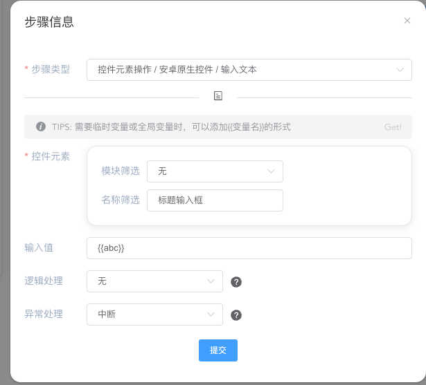

---
contributors:
- 'ZhouYixun'
---

# 进阶教学

本页为 **笔记App** 为例，介绍如何使用进阶UI自动化功能。

## 全局参数
当我们一个简单的UI自动化用例完成时，我们部分输入参数需要抽离出来维护。

1. 前往【全局参数】页面，添加新的全局参数。如参数名为 abc，内容为123456
2. 调整原输入步骤中的输入内容为新增的全局参数

当我们下发测试任务的时候，就会发现{{abc}}会替换为123456

::: tip 提示
如果希望同一个参数名分发给不同设备时为不同的值，可以查看 [特殊用法](https://sonic-cloud.cn/doc/doc-global.html#%E7%89%B9%E6%AE%8A%E7%94%A8%E6%B3%95)

目前全局参数可用于：
- 控件信息
- 应用名、包名
- 输入文本
- WebView名称
- Handle名称
- 等等...
:::

## 公共步骤

当我们多个用例含有重复的步骤，我们可以提取为公共步骤进行维护。

::: tip 提示
详情可以查看 [公共步骤文档](https://sonic-cloud.cn/doc/doc-pub.html)
:::

## 配合Jenkins插件

如果希望Jenkins构建了apk或者ipa包之后，能自动上传到Sonic平台并进行批量安装、测试，可以使用 sonic-ci-helper-plugin

::: tip 提示
详情可以查看 [sonic-ci-helper-plugin使用文档](https://sonic-cloud.cn/sch/re-sch.html)
:::

## 结语

简单的进阶教学就到这里了。更多 自定义脚本、迭代控件列表、切换WebView 等等有趣的功能可以前往【测试步骤相关】查看，可以按需使用。愿Sonic能给你带来友好的使用体验。

::: tip
更多疑问可前往 👉[社区](https://sonic-cloud.wiki)👈 交流
:::
