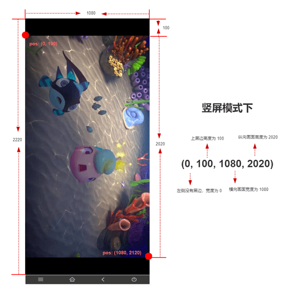

---
contributors:
  - 'ZhouYixun'
---

# POCO 控件

使用 POCO 控件相关步骤的注意事项以及教学。

## 注意事项与介绍

目前 Sonic 已支持游戏自动化的引擎有：

1. Unity3D
2. UE4
3. Egret
4. Cocos2dx-js
5. Cocos2dx-lua
6. Cocos2dx-c++
7. cocos-creator

::: tip 注意
接入 POCO-SDK 时，如果有更改默认的 socket 启动端口，可以在【启动 PocoDriver】步骤中指定连接端口的值。
:::

使用 POCO 相关步骤时，需确保：

1. 被测控件类型为游戏控件
2. 对应游戏包已经接入 POCO-SDK。 👉[POCO 官方接入指南](https://poco.readthedocs.io/en/latest/source/doc/integration.html)
3. 已经打开接入 SDK 的对应引擎页面。

## POCO 定位语法

poco 控件默认属性如下：

```java
        private String layer;
        private String name;
        private String tag;
        private String text;
        private String texture;
        private Integer _instanceId;
        private Integer _ilayer;
        private String type;
        private Boolean visible;
        private ZOrders zOrders;
        private List<String> components;
        private List<Float> anchorPoint;
        private List<Float> scale;
        private List<Float> size;
        private List<Float> pos;
        private Boolean clickable;

        public class ZOrders{
            private Integer global;
            private Integer local;
        }
```

POCO 游戏控件目前支持三种定位方式:

1. poco 类型
2. xpath 类型
3. cssSelector 类型

### poco 类型定位

定位时，需要以 poco 开头如：

```python
poco("Hello")
```

poco 后的括号内可填入属性值进行筛选，不填属性值默认查找 name 字段。如：

```python
poco(type="Button", name="Hello")
poco(_instanceId=123)
poco(visible=true)
```

poco 后可以接上 child 来搜索子控件列表，默认搜索第一个结果，如果指定了数组 index，会获取数组 index 下标的控件，当子控件数组长度小于 index 时，自动获取最末位。如：

```python
poco(type="Button", name="Hello").child(text="Star")[1]
```

### xpath 类型定位

只需跟普通 xpath 相同语法即可，如：

```bash
//*[@text="Hello" and @type="button"]
```

### cssSelector 类型定位

只需跟普通 cssSelector 相同语法即可，如：

```css
Root > Camera > Button > Text
```

## 关于非全屏应用定位偏移

有的应用不支持全屏展示，导致出现黑边而引起定位偏差。

Sonic 已经兼容自动了大部分机型的非全屏偏移，如果自动兼容效果不够友好：

1. 先关闭手机的**虚拟键盘**，查看应用是否能占用全屏。
2. 如果仍然出现黑边，可以使用【设置偏移量】步骤。

## 偏移量设置

偏移量设置有四个值，分别是：

1. offsetWidth
2. offsetHeight
3. windowWidth
4. windowHeight

其代表的内容如下图所述：



例如分辨率是 1080x2220，上方黑边高度为 100px，屏幕高度为 2020px，底部黑边高度为 100px，因此四个值为（0, 100, 1080, 2020）
