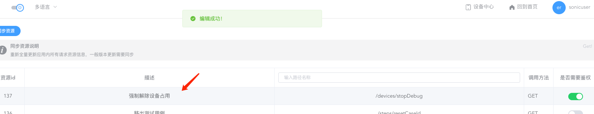

---
contributors:
- 'ZhouYixun'
---

# 自动与强制解除占用

::: tip 注意
该功能需升级至 v2.3.0
:::

## 自动解除占用

1. 可前往后台管理中心配置超时时间（默认480分钟，即八小时），**不影响测试中的设备，仅仅影响远控的设备和通过REST API占用的设备**。

2. 远控页面即可看到自动解除时间，超时后远控页面将自动关闭。

## 强制解除占用

1. 当设备为【占用中】的状态，可以点击状态标签打开弹窗进行操作

2. 该功能默认开启鉴权，只有超管能使用。当然你也可以通过【角色管理】分配权限，再分配角色给用户来实现部分用户也拥有这个权限。

