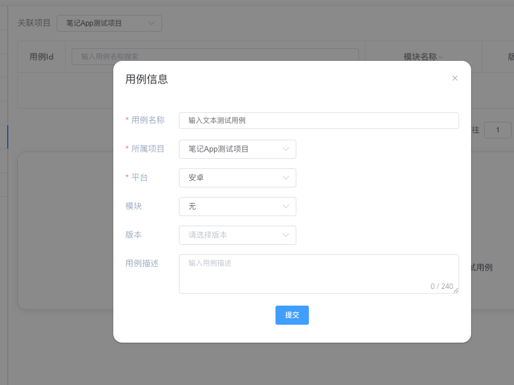
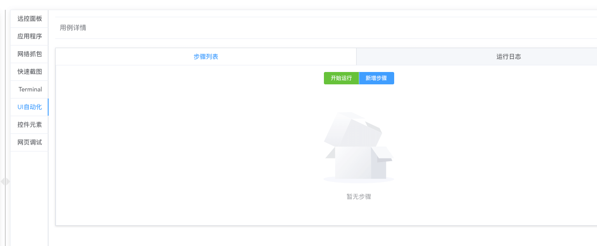
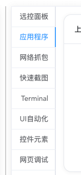
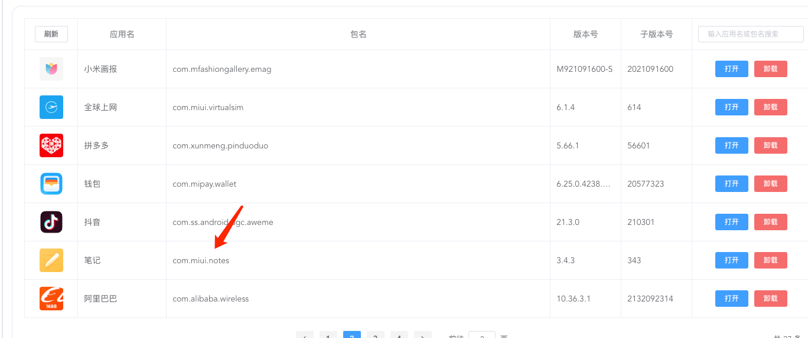
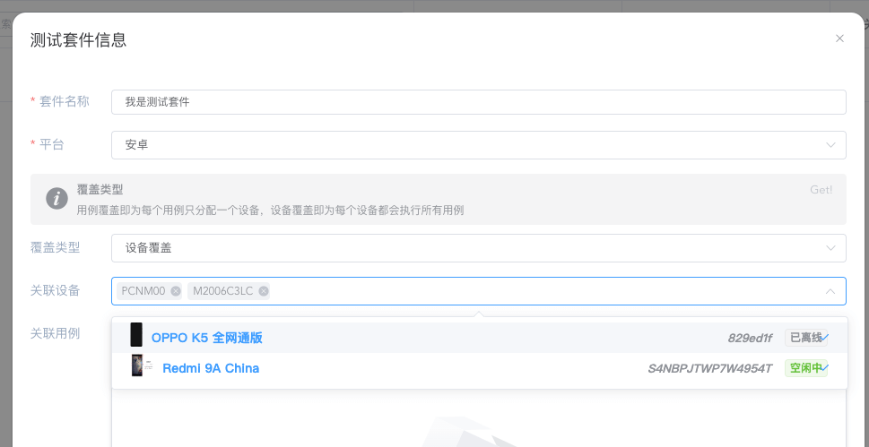
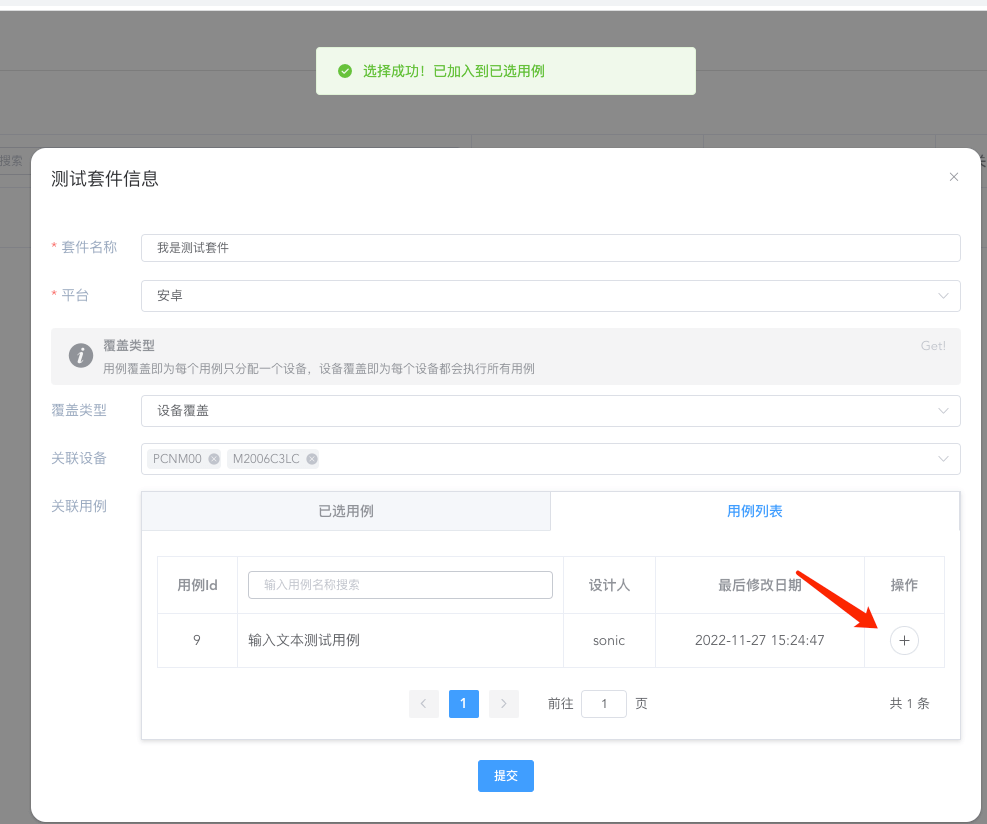
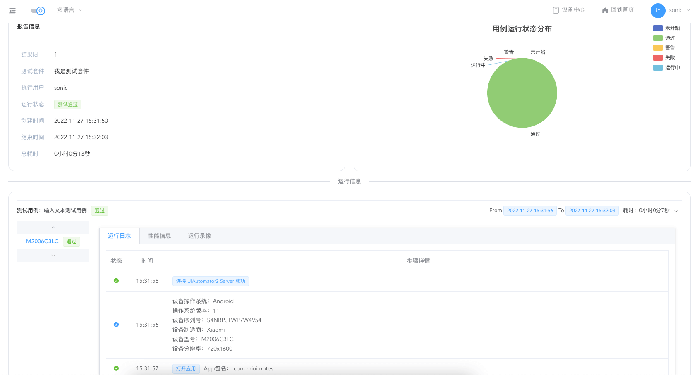

---
contributors:
  - 'ZhouYixun'
---

# 快速上手

本页为 **笔记 App** 为例，介绍如何使用 UI 自动化功能。

::: tip
如果您单纯使用远控功能，可以跳过本页。
:::

## 创建项目

给你的被测 App 创建项目。

## 开始远控

::: tip 注意
如果不清楚如何接入设备，可以前往 [部署文档](https://sonic-cloud.cn/deploy/android-deploy.html)
:::

接入设备后，点击马上使用

## 绑定项目创建用例

1. 点击【UI 自动化】标签
2. 选择项目后，点击【新增用例】

   

3. 点击创建好的用例，绑定完成

   

## 获取 App 包名

1. 点击【应用列表】标签

   

2. 找到被测 App 的包名，点击即可复制

   

3. 回到【UI 自动化】标签
4. 点击【新建步骤】，创建【打开应用】步骤，将包名粘贴，点击保存

## 获取控件

1. 点击【控件元素】标签，点击【获取控件元素】

   

2. 点击快捷添加控件按钮

   

3. 输入控件名称保存

   

4. 回到【UI 自动化】标签
5. 点击【新建步骤】，创建【点击控件】步骤，选择刚刚添加的控件，点击保存

## 开始调试

1. 查看新增好的步骤，点击开始运行

   

2. 查看日志，确保稳定运行

   

## 添加测试套件

1. 退出远控，进入被测 App 的项目
2. 进入测试套件标签页，点击添加测试套件按钮

   

3. 填入相关信息，选择对应设备

   

4. 选择刚刚调试完毕的测试用例，并加入到其中

   

5. 检查信息无误，点击提交

   

## 运行测试套件

1. 选择刚刚创建完毕的测试套件，点击运行

   

2. 点击测试报告页面，即可查看本次执行结果

   

至此，一个简单的 UI 自动化流程就到这里结束了。
