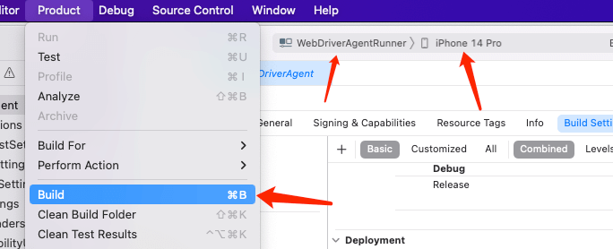

---
contributors:
- 'ZhouYixun'
- 'soniclei'
- 'shinyvince'
---

# iOS device access

This article will introduce the preparations for connecting iOS devices to Sonic.

## Access common configuration

1. Connect the device to the computer via USB
2. Click【Trust】Computer
3. Build WebDriverAgent into the device (required for the first connection, please refer to the construction tutorial below)
4. Settings related to webpage debugging: Settings → Safari → Advanced → Open [Webpage Inspector]
5. Turn off the phone lock screen password: Settings → Face ID and password → turn off the password (if it is not turned off, the sonic may always display the connection and the phone is blocked on the password input page when using it remotely)

## iOS16 special configuration

iOS16 needs to manually enable the developer options.

1. Open Settings and enter [Privacy and Security].
2. Click [Developer Mode].
3. If a pop-up prompting to restart appears, click Restart.
4. If you are asked whether to enable the developer mode after startup, click Open.

## Build WebDriverAgent into the device

Build wda to your iOS device.
::: tip note
After the build is successful, it can be separated from the Mac, and the iOS device can also be used on the Agent of Windows or Linux. Prepare a personal free certificate (expires in 7 days), preferably with a developer account.
:::
Preparations: Mac, Xcode, developer account.

1. Pull the WebDriverAgent project of Sonic. (This project corresponds to the v6.1.1 version of appium/WebDriverAgent. Since 7.x has some destructive updates to the touch API, the Sonic organization temporarily retains this version as the basis.)

```bash
git clone https://github.com/SonicCloudOrg/sonic-ios-wda.git
```

2. Change the Signing Team in **WebDriverAgentLib** and **WebDriverAgentRunner** to your own developer account.


3. Modify **Product Bundle Identifier** in Build Settings in **WebDriverAgentRunner**
   For your own custom package name (preferably keep the end of WebDriverAgentRunner)


::: warning note
Some Xcode versions will reset the signed Team after modifying the package name, and the signature in the second step needs to be changed again
:::

4. Select **WebDriverAgentRunner** as the build target for Scheme, and select the target device on the right. Then select Product -> Build to build. if you want to test
   Whether WebDriverAgent can run normally, you can also select Product -> Test to view the operation log.



::: warning note
If there is an error building to the phone, it may be caused by not having a trusted certificate. After connecting to the network, please trust it in Settings--General--Description File and Management.
:::

5. Build complete! You can configure the corresponding custom BundleId in the yml file in the config folder on the Agent side.

::: tip note
After the access is completed, you can use iOS without the Mac (Windows needs to install iTunes). If the certificate expires, you need to re-use the Mac to install the certificate
:::

## Build the ipa file

If you only want to build it once and then package it into wda.ipa to share with other devices, you can refer to this method.

The phone udId must be under the developer account.

```bash
$ xcodebuild build-for-testing -scheme WebDriverAgentRunner -sdk iphoneos -configuration Release -derivedDataPath /tmp/derivedDataPath
$ cd /tmp/derivedDataPath
$ cd Build/Products/Release-iphoneos
$ mkdir Payload && mv *.app Payload
$ zip -r WDA.ipa Payload
$ sib app install -p WDA.ipa
```

::: tip
For the use of sib, you can go to the surrounding ecology.
:::

## Frequently Asked Questions (Q&A)

Q1: Failed to start after packaging wda.

A1: Please check whether the bundleId configured in yml is consistent, whether the device trusts the certificate, and whether the device trusts the computer.

---

Q2: No screen appears after use, but the key operation is normal.

A1: The solution can refer to [this post](https://sonic-cloud.wiki/d/27-ios).

---

::: tip
For more questions, please go to 👉[Community](https://discord.gg/c9ZD6jSyTE)👈 to communicate
:::
