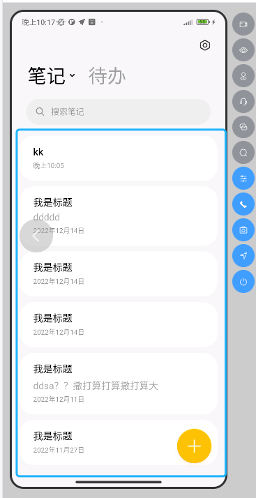
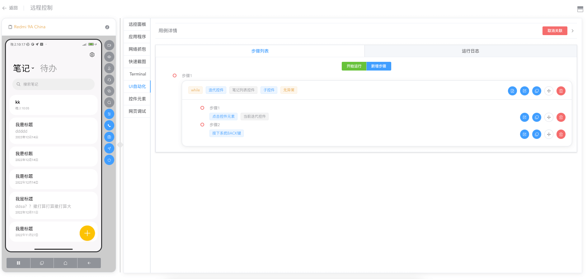
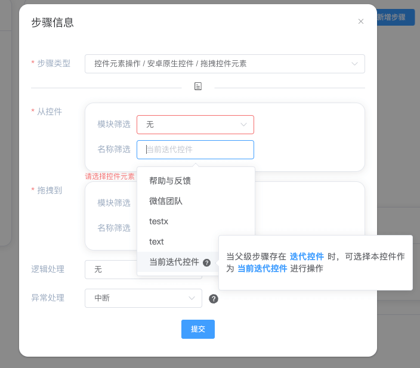
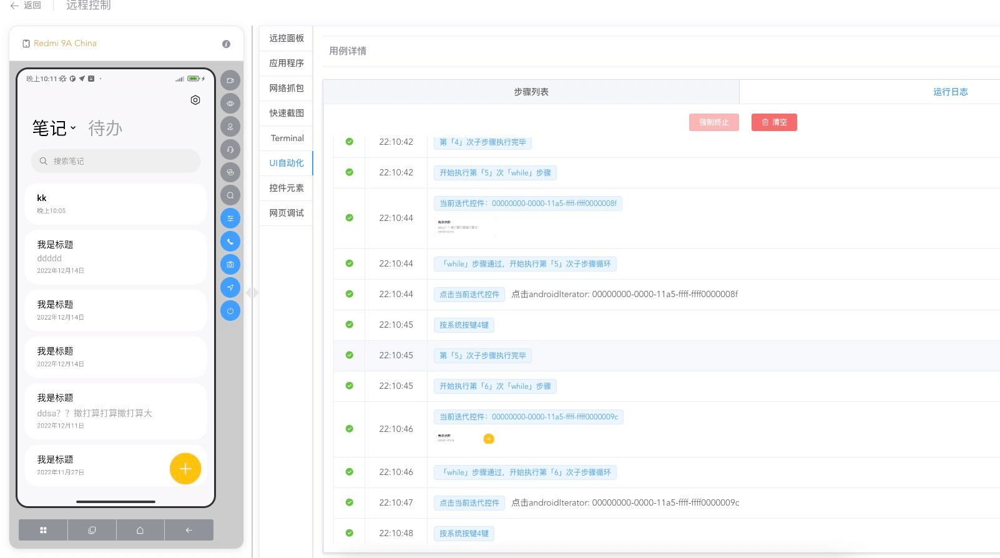

---
contributors:
- 'ZhouYixun'
---

# Iterate the element list

The sublist element of the iterator element. (This function needs to be upgraded to Sonic v2.2.0 version)

## Features

When Sonic performs UI automation, if you need to operate list type elements, it will be a headache, unless you use custom scripts, otherwise you need to add elements one by one to operate.

But if you use the [Iterate element list] function, you can realize that you only need to add a list element, and you can continuously iterate each sub-element in the list for operation.

## Instructions

1. First find the parent element of the element list, quickly copy the xpath of the parent element, and then add the className of the child element at the end of the xpath, then the final result of the xpath search is the entire element list.

::: tip note
Of course, not only xpath, but also effective if the resource-id can locate multiple elements with the same resource-id.

Other positioning methods are the same.
:::

2. Add the [Iterate element list] step, select the newly added element

3. Select the iterative element to be operated in the sub-step, the [current iterative element] in the figure is each sub-element in the list

4. Run, you will find that each element in the list will execute all sub-steps

## Applicable elements

The current functional scope is as follows

1. Android native elements
2. iOS native elements
3. POCO element

We are working hard to adapt the web element...
