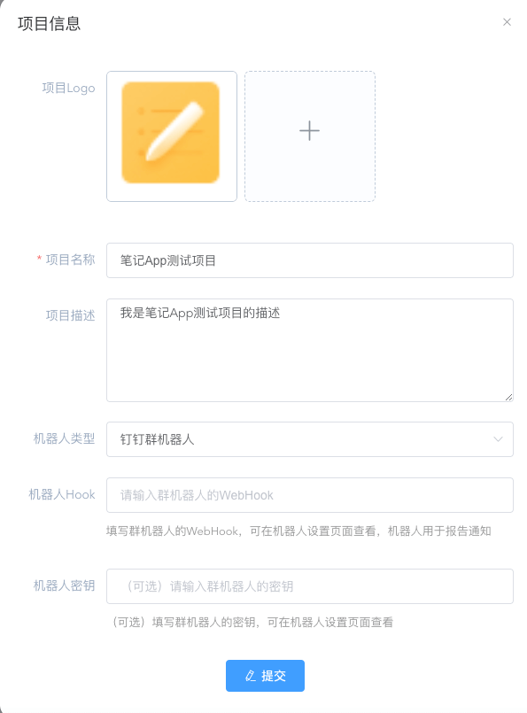
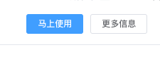
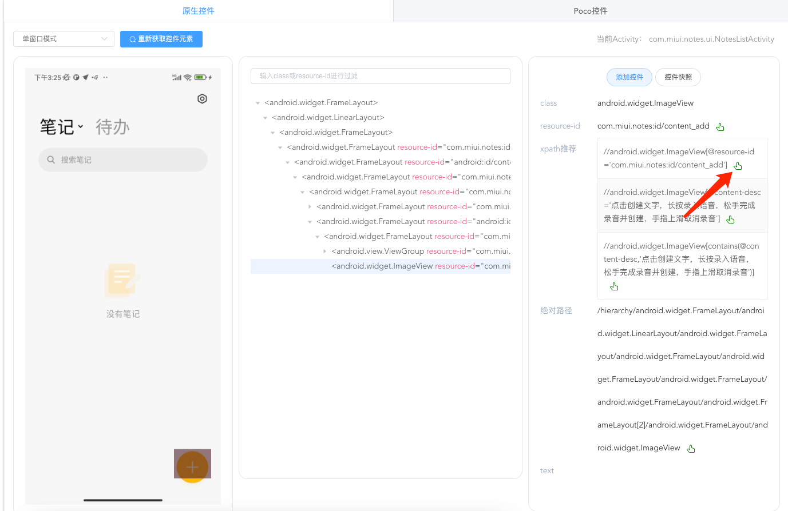
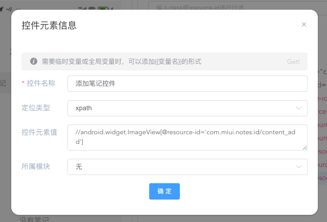
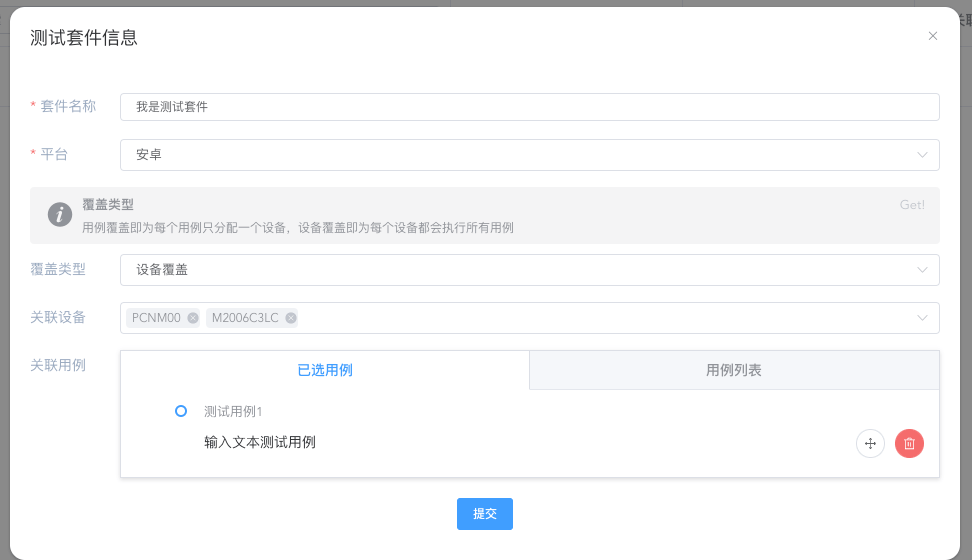

---
contributors:
- 'ZhouYixun'
---

# Get started quickly

This page takes **Note App** as an example to introduce how to use the UI automation function.

::: tip
If you only use the remote control function, you can skip this page.
:::

## Create project

Create a project for your app under test.

## Start remote control

::: tip note
If you don't know how to access the device, you can go to [deployment document](https://sonic-cloud.cn/deploy/android-deploy.html)
:::

After accessing the device, click to use it immediately

## Binding project creation use case

1. Click the [UI Automation] tab
2. After selecting a project, click [Add Use Case]

   

3. Click the created use case, the binding is complete

   

## Get App package name

1. Click the [Application List] tab

   

2. Find the package name of the app under test and click to copy it

   

3. Go back to the 【UI Automation】tab
4. Click [New Step] to create the [Open Application] step, paste the package name, and click Save

## Get element

1. Click the [Element] tab, click [Get Element]

   

2. Click the Quick Add element button

   

3. Save the input element name

   

4. Go back to the 【UI Automation】tab
5. Click [New Step] to create a [Click element] step, select the element you just added, and click Save

## start debugging

1. Check the newly added steps and click to start running

   

2. Check the log to ensure stable operation

   

## Add test suite

1. Exit the remote control and enter the project of the app under test
2. Go to the Test Suite tab and click the Add Test Suite button

   

3. Fill in the relevant information and select the corresponding device

   

4. Select the test case that has just been debugged and add it to it

   

5. Check that the information is correct and click Submit

   

## Run the test suite

1. Select the test suite just created and click Run

   

2. Click the test report page to view the execution results

   

At this point, a simple UI automation process ends here.
