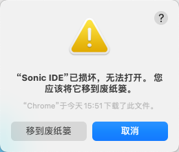

---
contributors:
- 'ZhouYixun'
---

# Sonic IDE介绍与下载

::: warning 注意！
该生态需要Sonic v2.5.0或以上搭配使用，请先将Sonic平台升级至对应版本
:::

本文为Sonic IDE的介绍与下载。 👉[Github地址](https://github.com/SonicCloudOrg/sonic-ide)

<div style="display: flex">


</div>


## 介绍

<video class="capacity-video" controls src="./video/show.mp4"/>

**Sonic IDE** 是Sonic平台打造的IDE编辑器，可以支持直接调试内部Sonic平台的设备，如果您不习惯Sonic提供的无脚本自动化方案，那么IDE或许是你的选择。
目前包含以下多种功能
1. 远程控制设备
2. 实时控件获取
3. 支持多种语言编程
4. 等等...

后续会继续扩展更多新鲜好玩的功能，如GPT接入等等。**目前IDE还是一个很初版的形态，我们也承诺会继续保持免费，还需大家多多提建议，我们一起把他做得更好**

## 下载使用

::: info Macosx:

👉 <a href="https://ghproxy.com/https://github.com/SonicCloudOrg/sonic-ide/releases/download/v0.0.2/Sonic.IDE-0.0.2-arm64.dmg" target="_blank">Sonic.IDE-0.0.2-arm64.dmg</a>

👉 <a href="https://ghproxy.com/https://github.com/SonicCloudOrg/sonic-ide/releases/download/v0.0.2/Sonic.IDE-0.0.2-x64.dmg" target="_blank">Sonic.IDE-0.0.2-x64.dmg</a>

:::

::: info Windows:

👉 <a href="https://ghproxy.com/https://github.com/SonicCloudOrg/sonic-ide/releases/download/v0.0.2/Sonic.IDE-0.0.2.exe" target="_blank">Sonic.IDE-0.0.2.exe</a>

:::

## Mac使用常见问题

Q1: 为什么Mac arm64使用会报已损坏不可使用？



A1: 可以尝试执行这个指令
```shell
sudo xattr -d com.apple.quarantine /Applications/Sonic\ IDE.app
```
如果没能解决，可能是部分arm64架构不适用，可以尝试更换x64架构的dmg安装包

---

Q2: 为什么Mac使用会报无法打开，因为无法验证开发者？


A2: 因为Sonic IDE还没上架到App Store，苹果会因为安全策略默认无法打开，解决方案如下
1. 遇到上方的弹窗点击【取消】，不要点击【移到垃圾篓】。
2. 打开【系统】->【安全性与隐私】，选择仍然使用
   
3. 再次打开，选择【打开】
   
