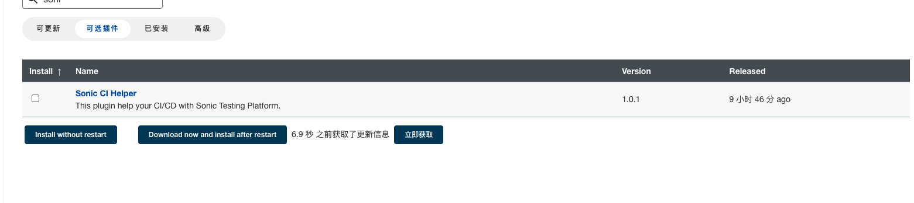
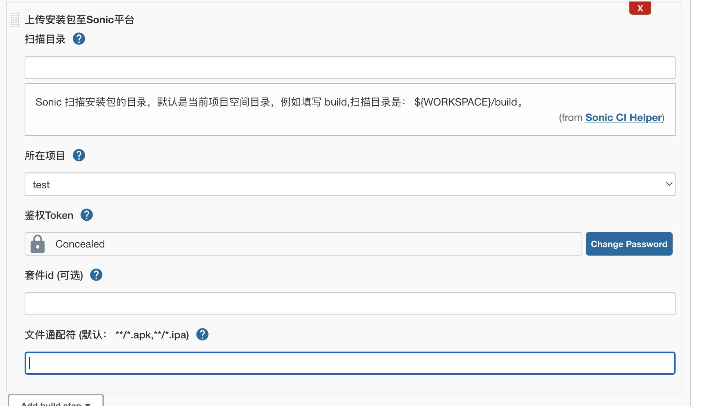

---
contributors:
  - 'ZhouYixun'
---

# sonic-ci-helper-plugin

本文为 Sonic Jenkins 插件 sonic-ci-helper-plugin 的介绍与原理简述。 👉[Github 地址](https://github.com/jenkinsci/sonic-ci-helper-plugin)

<div style="display: flex">


</div>

## 本仓库贡献者

<a href="https://github.com/jenkinsci/sonic-ci-helper-plugin/graphs/contributors">
  
</a>

## 介绍

**sonic-ci-helper-plugin** 是为对接 Jenkins CI 流程建设的小助手。计划可以对接 CI 流程所需要的步骤。

后续会继续扩展更多新鲜好玩的功能，也欢迎大家一起参与建设~

## 快速使用

### 一、在线安装

1. 进入 【管理 Jenkins】 -> 【插件管理】 视图
2. 搜索 Sonic CI Helper 安装即可

   

### 二、离线安装

1. 点击下载链接。如 **加速链接失效** 或 **想查找旧版本**，请前往 <a href="https://github.com/jenkinsci/sonic-ci-helper-plugin/releases" target="_blank">这里</a> 下载

::: info 下载地址
👉<a href="https://download.fastgit.org/jenkinsci/sonic-ci-helper-plugin/releases/download/sonic-ci-helper-1.0.4/sonic-ci-helper.hpi" target="_blank">sonic-ci-helper-1.0.4.hpi</a>
:::

2. 前往 Jenkins 的插件管理页面，选择手动安装插件，将 hpi 文件上传即可。  


### 三、使用帮助

#### 字段解析
| 字段名     |字段解释     | 数据类型   | 描述信息                   |
|---------|---------|--------|------------------------|
|scanDir | 扫描目录    | string | App包所在目录,默认是当前项目空间目录，例如填写 build,扫描目录是： ${WORKSPACE}/build。（可选）              |
|projectId | 对应项目    | int    | 选取的项目id             |
|apiKey | 鉴权Token | String | 可前往Sonic平台右上角用户头像处生成填入  |
|suiteId | 测试套件id  | int    | 构建后触发的测试套件id（可选），为空则不触发       |
|wildcard | 文件通配符   | string | 默认 （**/*.apk,**/*.ipa），支持通配符号，如果想要 sonic 开头的 apk 可以这样： **/sonic-*.apk |
|isRunSuite | 是否运行测试套件  | bool    | 默认值：true ,可以设置环境变量或参数化构建过程     |
|isUploadSonic | 是否上传 sonic  | bool    | 默认值：true  ,可以设置环境变量或参数化构建过程        |

#### pipeline 

```pipeline
        stage('sonic') {
            steps {
                step([$class:"UploadBuilder" ,apiKey: '1212', projectId: '1',wildcard:"**/us-*.apk"])
            }
        }
```

#### 自由风格项目


